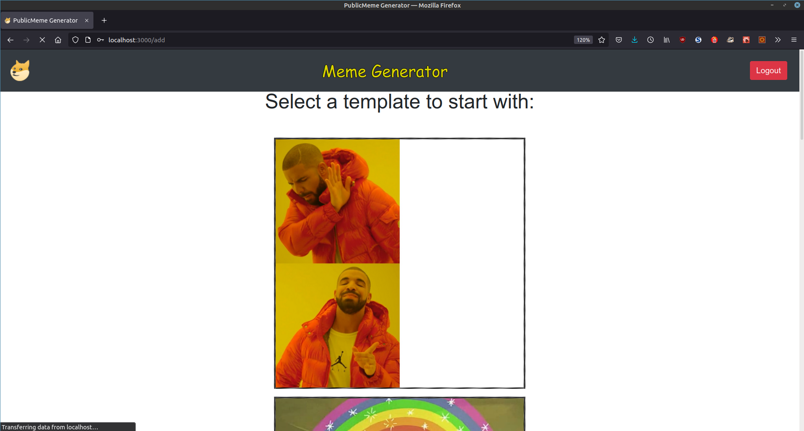
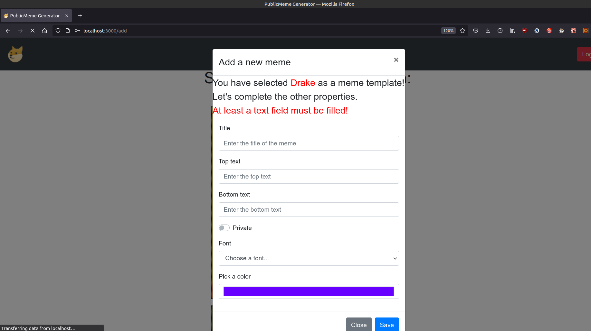

# Exam: ["Meme Generator"](./assignment/WA1_exam2_meme_generator_FINAL.pdf)
## Student: [@ninosanta](https://github.com/ninosanta)

## React Client Application Routes

- Route `/login`: login page triggered by non-authenticated users by clicking on a `login` button placed on the Navbar
- Route `/public`: it is the home page for non-logged-in users. It shows `public` memes
- Route `/private`: it is the home page for logged-in users. It shows `public` **and** `peivate` memes
- Route `/add`: page to add a new meme from scratch. It is linked to the add-button showed on the `private` page so that only logged-in users can add new memes


## API Server

### Meme management

#### Get public memes

* HTTP method: `GET`  URL: `/api/memes`
* Description: Get the full list of memes or just the `public` ones
* Request body: _None_
* Request query parameter: _None_
* Request example:
  ``` JSON
  GET http://localhost:3001/api/memes
  Content-type: text/plain
  ```
* Response: `200 OK` (success)
* Response body: Array of objects, each describing a meme:
  ```JSON
  [{
      "mID": 1,
      "iID": 1,
      "sID": 2,
      "uID": 1,
      "creator": "John",
      "uname": "john.doe@polito.it",
      "title": "Drake",
      "visibility": "public",
      "text1": "Test1",
      "text2": "",
      "text3": "Test2",
      "font": "cursive",
      "color": "yellow",
      "path": "/images/drake.jpg",
      "name": "Drake",
      "box_count": 2,
      "position": "right",
      "top": 1,
      "middle": 0,
      "bottom": 1
  }]
  ```
* Error responses:  `500 Internal Server Error` (generic error)

#### Get public and private memes

* HTTP method: `GET`  URL: `/api/privatememes`
* Description: Get the full list of memes both `public` and `private` ones
* Request body: _None_
* Request query parameter: _None_
* Request example:
  ```JSON
  GET http://localhost:3001/api/privatememes
  Content-type: text/plain
  ```
* Response: `200 OK` (success)
* Response body: Array of objects, each describing a meme:
  ```JSON
  [{
      "mID": 1,
      "iID": 1,
      "sID": 2,
      "uID": 1,
      "creator": "John",
      "uname": "john.doe@polito.it",
      "title": "Drake",
      "visibility": "private",
      "text1": "Test1",
      "text2": "",
      "text3": "Test2",
      "font": "cursive",
      "color": "yellow",
      "path": "/images/drake.jpg",
      "name": "Drake",
      "box_count": 2,
      "position": "right",
      "top": 1,
      "middle": 0,
      "bottom": 1
  }]
  ```
* Error responses:  
  `500 Internal Server Error` (generic error)\
  `401 Unauthorized` (for non-logged-in users)
  
#### Get all images

* HTTP method: `GET`  URL: `/api/images`
* Description: Get the full list of images stored in the `public/images` folder
* Request body: _None_
* Request query parameter: _None_
* Request example:
  ``` JSON
  GET http://localhost:3001/api/images
  Content-type: text/plain
  ```
* Response: `200 OK` (success)
* Response body: Array of objects, each describing an image:
  ```JSON
  [{
      "iID": 1,
      "path": "/images/drake.jpg",
      "name": "Drake",
      "box_count": 2,
      "position": "right",
      "top": 1,
      "middle": 0,
      "bottom": 1
  }]
  ```
* Error responses:  `500 Internal Server Error` (generic error)


#### Add a new meme
* HTTP method: `POST`  URL: `/api/memes`
* Description: Add a new meme 
* Request body: `JSON` description of the object to be added (meme id i.e., `mID` is not required and would be ignored because the DB automatically manages the IDs)
  ```JSON
  { 
      "mID": 1, 
      "iID": 1, 
      "sID": 6, 
      "uID": 2, 
      "creator": "Johnny",
      "uname": "johnny.doe@polito.it", 
      "title": "Technically the truth", 
      "visibility": "public" 
  }
  ```
* Response: `200 OK` (success)
* Response body: the object as represented in the database
* Error responses: 
  `422 Unprocessable Entity` (values do not satisfy validators)\
  `503 Service Unavailable` (database error)\
  `401 Unauthorized` (for non-logged-in users)

#### Add a new sentence
* HTTP method: `POST`  URL: `/api/memes`
* Description: Add a new sentence row in the DB
* Request body: `JSON` description of the object to be added (sentence id i.e., `sID` is not required and would be ignored because the DB automatically manages the IDs)
  ```JSON
  {   
      "sID": 1,
      "iID": 1, 
      "text1": "3+2=", 
      "text2": "", 
      "text3": "3-2=", 
      "font": "fantasy", 
      "color": "black" 
  }
  ```
* Response: `200 OK` (success)
* Response body: the object as represented in the database
* Error responses:
  `422 Unprocessable Entity` (values do not satisfy validators)\
  `503 Service Unavailable` (database error)\
  `401 Unauthorized` (for non-logged-in users)

#### Delete an existing meme
* HTTP method: `DELETE`  URL: `/api/tasks/:id`
* Description: a logged user delete an existing meme and its relate text fields
* Request body: _None_
* Request example:
  ``` JSON
  DELETE http://localhost:3001/api/memes/2
  Content-type: text/plain
  ```
* Response: `200 OK` (success)
* Response body: an empty object
* Error responses:  `500 Internal Server Error` (generic error)


### User management

#### Login
* HTTP method: `POST`  URL: `/api/sessions`
* Description: authenticate the user who is trying to login
* Request body: credentials of the user who is trying to login
  ``` JSON
  {
      "username": "username",
      "password": "password"
  }
  ```
* Response: `200 OK` (success)
* Response body: authenticated user
  ``` JSON
  {
      "id": 1,
      "username": "john.doe@polito.it", 
      "name": "John"
  }
  ```
* Error responses:  `500 Internal Server Error` (generic error), `401 Unauthorized User` (login failed)


#### Check whether user is logged in
* HTTP method: `GET`  URL: `/api/sessions/current`
* Description: check whether current user is logged in and get her data
* Request body: _None_
* Response: `200 OK` (success)
* Response body: authenticated user
  ``` JSON
  {
      "id": 1,
      "username": "john.doe@polito.it", 
      "name": "John"
  }
  ```
* Error responses:  `500 Internal Server Error` (generic error), `401 Unauthorized User` (user is not logged in)


#### Logout
* HTTP method: `DELETE`  URL: `/api/sessions/current`
* Description: logout current user
* Request body: _None_
* Response: `200 OK` (success)
* Response body: _None_
* Error responses:  `500 Internal Server Error` (generic error), `401 Unauthorized User` (user is not logged in)


## Database Tables

- Table `users` - contains `uID`, `email`, `name`, `hash`
- Table `images` - contains `iID`, `path`, `name`, `box_count`, `position`, `top`, `middle`, `bottom`
- Table `sentences` - contains `sID`, `iID`, `text1`, `text2`, `text3`, `font`, `color`
- Table `memes` - contains `mID`, `iID`, `sID`, `uID`, `creator`, `uname`, `title`, `visibility`


## Main React Components

- `Login` (in `Login.js`): it provides a modal to provide user's credentials, and it handles the login phase 
- `LoginButton` (in `Login.js`): it links to the _/login_ Route where the _Login_ component will be fetched
- `LogoutButton` (in `Login.js`): _onClick_ it triggers the logout 
- `ModalAddOrCopy` (in `ModalAddOrCopy.js`): it is a _Form_ within a _Modal_ that appears whenever a new meme has to be built
  starting from an image (i.e., from scratch in the add) or starting from another meme. The _Form_ must be filled with the meme
  properties ad has to respect some constraints.
- `MyNavbar` (in `MyNavbar.js`): it is the navbar of the site. It is the place where the login/logout button appears
- `NewMeme` (in `NewMeme.js`): it is rendered in the _add_ Route. This component displays the list of images from which 
  start a new meme creation
- `ClickableImage` (in `NewMeme.js`): the images cited above are made clickable by this component which embeds the _ModalAddOrCopy_ 
   within them
- `PrivatePage` (in `PrivatePage.js`): it is rendered in the _/private_ Route and renders the list of both `public` and 
  `private` memes. It shows the add button too
- `PrivateMeme` (in `PrivateMeme.js`): it builds the _private_ memes. Furthermore, this component embeds within the memes 
  loaded by _PrivatePage_ the _Delete_, and the _Copy_ functions. The latter exploits the _ModalAddOrCopy_ which is triggered
  by the Copy button 
- `PublicPage` (in `PublicPage.js`): like _PrivatePage_ but only for _public_ memes and without the add button. Rendered 
    in the _/public_ Route
-  `ShowProperties` (in `ShowProperties.js`): each _public_ meme once clicked shows a modal with its properties.
   This component defines that modal  
- `PublicMeme` (in `PublicMeme.js`): this component builds the _public_ meme and its properties to be shown through 
  _ShowProperties_ component


## Screenshot




## Users Credentials

| email | password | name | created memes |
|-------|----------|------|---------------|
| john.doe@polito.it | password | John | Bug fixing, Brains, Sad but true - Copy |
| johnny.cage@polito.it | password | Johnny | Technically the truth - Copy, Sad but true, Programs |
| ninosanta@polito.it | password | Nino | Technically the truth, Daily dilemma, Programs - Copy |